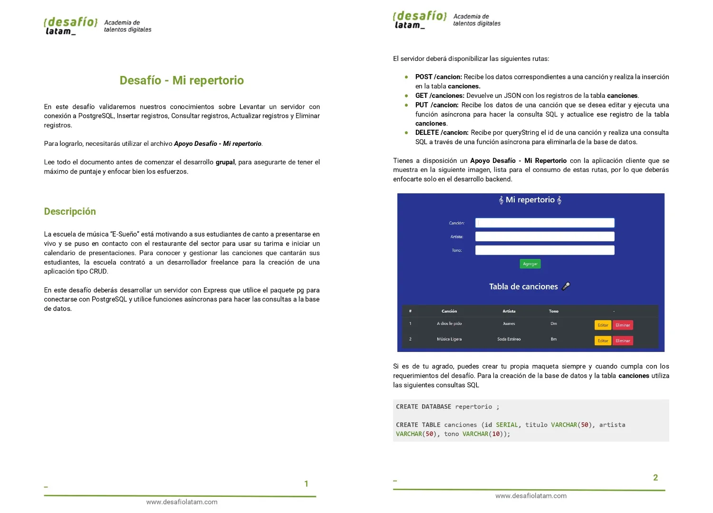
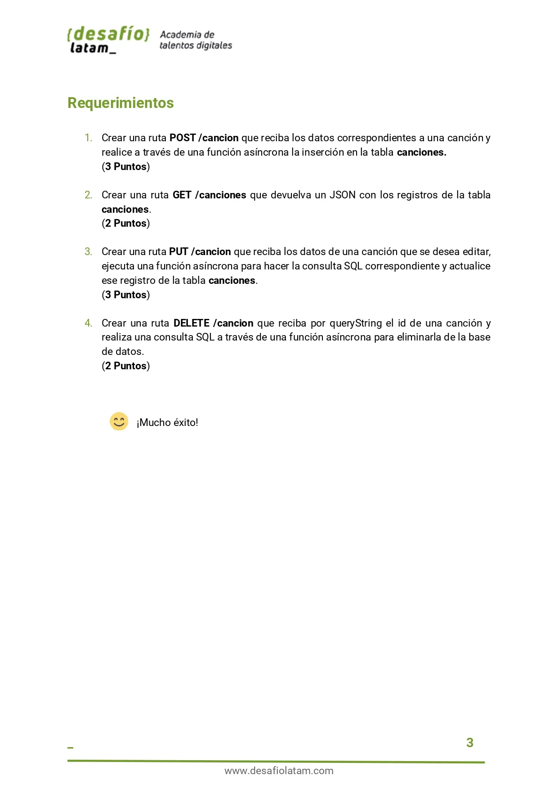
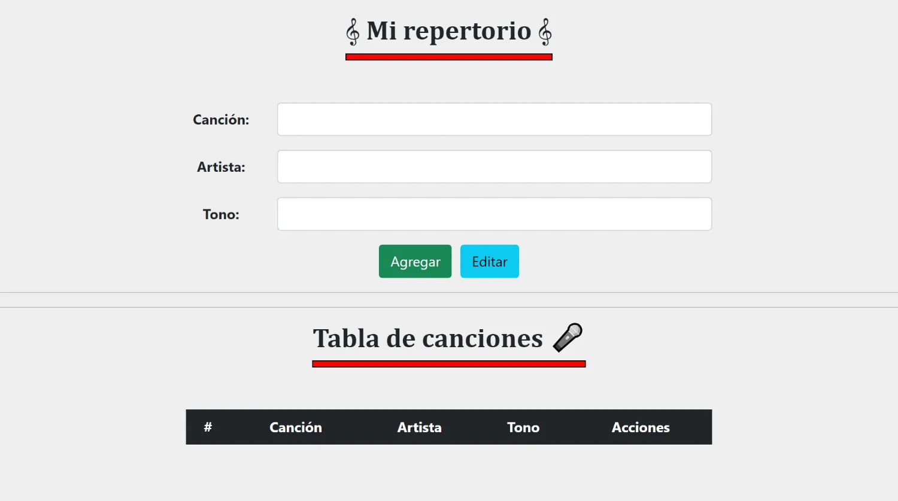
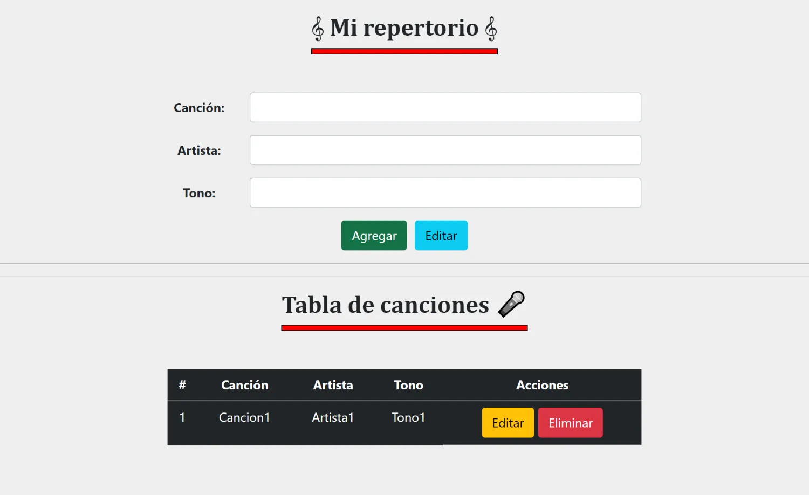
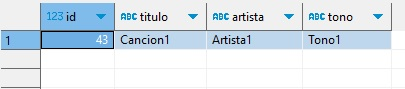
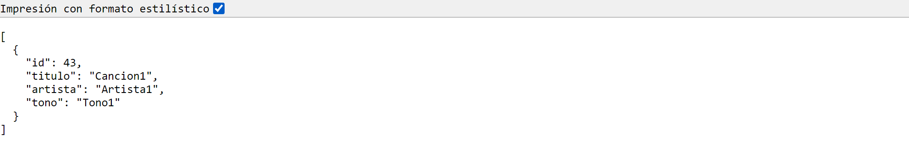
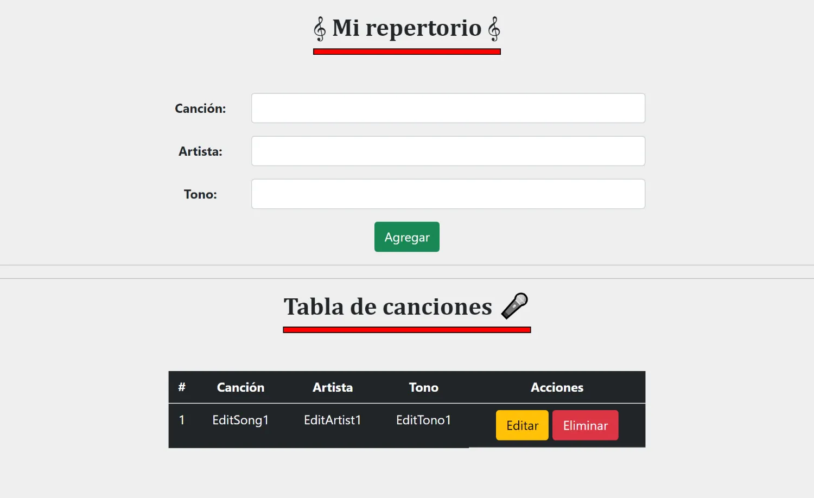
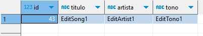
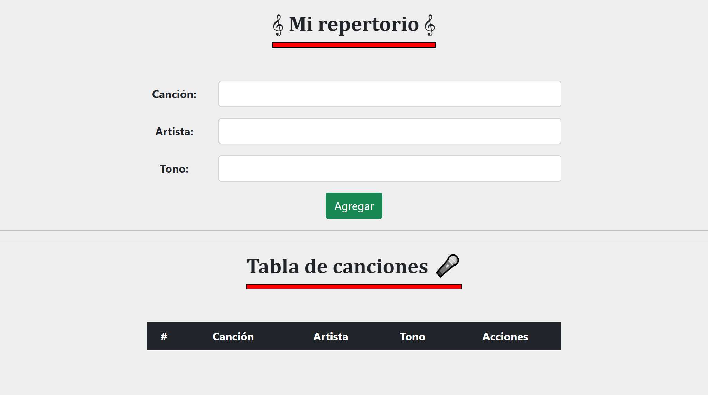
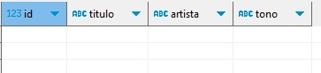

# Resolución Desafío - Mi repertorio

Repositorio con el código solución al desafío 4:**Mi repertorio** perteneciente al módulo 7 **Acceso a datos en aplicaciones Node** de la beca **Desarrollo de aplicaciones Full Stack Javascript Trainee** dada por Talento Digital para Chile y dictada por Desafío Latam.

## Tabla de Contenidos

- [Resolución Desafío - Mi repertorio](#resolución-desafío---mi-repertorio)
  - [Tabla de Contenidos](#tabla-de-contenidos)
  - [Requisitos](#requisitos)
  - [Soluciones](#soluciones)
    - [1. Crear una ruta POST /cancion que reciba los datos correspondientes a una canción y realice a través de una función asíncrona la inserción en la tabla canciones (3 Puntos)](#1-crear-una-ruta-post-cancion-que-reciba-los-datos-correspondientes-a-una-canción-y-realice-a-través-de-una-función-asíncrona-la-inserción-en-la-tabla-canciones-3-puntos)
      - [1.1. Creación de Canciones](#11-creación-de-canciones)
        - [1.1.1: Vista Inicio Vacía](#111-vista-inicio-vacía)
        - [1.1.2: Creación de Canción en Vista](#112-creación-de-canción-en-vista)
        - [1.1.3: Creación de Canción en Data Base](#113-creación-de-canción-en-data-base)
    - [2.Crear una ruta GET /canciones que devuelva un JSON con los registros de la tabla canciones. (2 Puntos)](#2crear-una-ruta-get-canciones-que-devuelva-un-json-con-los-registros-de-la-tabla-canciones-2-puntos)
      - [2.1. Consulta de Canciones](#21-consulta-de-canciones)
        - [2.1.1: Consulta de Canciones API](#211-consulta-de-canciones-api)
    - [3. Crear una ruta PUT /cancion que reciba los datos de una canción que se desea editar, ejecuta una función asíncrona para hacer la consulta SQL correspondiente y actualice ese registro de la tabla canciones. (3 Puntos)](#3-crear-una-ruta-put-cancion-que-reciba-los-datos-de-una-canción-que-se-desea-editar-ejecuta-una-función-asíncrona-para-hacer-la-consulta-sql-correspondiente-y-actualice-ese-registro-de-la-tabla-canciones-3-puntos)
      - [3.1. Edición de Canción](#31-edición-de-canción)
        - [3.1.1: Edición de Canción Vista](#311-edición-de-canción-vista)
        - [3.1.2: Edición de Canción Exitosa Data Base](#312-edición-de-canción-exitosa-data-base)
    - [4.Crear una ruta DELETE /cancion que reciba por queryString el id de una canción y realiza una consulta SQL a través de una función asíncrona para eliminarla de la base de datos. (2 Puntos)](#4crear-una-ruta-delete-cancion-que-reciba-por-querystring-el-id-de-una-canción-y-realiza-una-consulta-sql-a-través-de-una-función-asíncrona-para-eliminarla-de-la-base-de-datos-2-puntos)
      - [4.1. Eliminación de Canción](#41-eliminación-de-canción)
        - [4.1.1: Eliminación de Canción Vista](#411-eliminación-de-canción-vista)
        - [4.1.2: Eliminación de Canción en Base de Datos](#412-eliminación-de-canción-en-base-de-datos)

## Requisitos




## Soluciones

Debido a que se ha divido las funcionalidades en diferentes carpetas, mostraré de manera recursiva las funciones que se utilizan hacia atrás.

### 1. Crear una ruta POST /cancion que reciba los datos correspondientes a una canción y realice a través de una función asíncrona la inserción en la tabla canciones (3 Puntos)

La ruta creada es la siguiente:

```js
router.post("/cancion", crearCancion);
```

La cual hace uso de la siguiente **crearCancion**:

```js
export async function crearCancion(req, res) {
  const data = Object.values(req.body);
  try {
    const resultado = await agregarCancionQuery(data);
    res.status(200).send(resultado);
  } catch (error) {
    res.status(500).send(error.message);
  }
}
```

La que a su vez hace uso de la siguiente función **agregarCancionQuery** la cual crear la canción en la tabla **canciones** en la base de datos **repetorio**:

```js
export async function agregarCancionQuery(datos) {
  try {
    const consulta = {
      text: "insert into canciones (titulo,artista,tono) values ($1, $2, $3) returning *",
      values: datos,
    };
    const result = await pool.query(consulta);
    return result.rows;
  } catch (error) {
    throw error;
  }
}
```

#### 1.1. Creación de Canciones

##### 1.1.1: Vista Inicio Vacía



##### 1.1.2: Creación de Canción en Vista



##### 1.1.3: Creación de Canción en Data Base



### 2.Crear una ruta GET /canciones que devuelva un JSON con los registros de la tabla canciones. (2 Puntos)

La ruta creada es la siguiente:

```js
router.get("/canciones", obtenerCanciones);
```

La cual hace uso de la siguiente función **obtenerCanciones**:

```js
export async function obtenerCanciones(req, res) {
  try {
    const canciones = await getCancionesQuery();
    res.status(200).json(canciones);
  } catch (error) {
    res.redirect("/");
    res.status(500).send(error.message);
  }
}
```

Dicha función hace uso de la siguiente función **getCancionesQuery** que consulta a la tabla en la base de datos:

```js
export async function getCancionesQuery() {
  try {
    const consulta = {
      text: "SELECT * FROM canciones",
    };
    const result = await pool.query(consulta);
    return result.rows;
  } catch (error) {
    throw error;
  }
}
```

#### 2.1. Consulta de Canciones

##### 2.1.1: Consulta de Canciones API



### 3. Crear una ruta PUT /cancion que reciba los datos de una canción que se desea editar, ejecuta una función asíncrona para hacer la consulta SQL correspondiente y actualice ese registro de la tabla canciones. (3 Puntos)

He creado la siguienta ruta PUT:

```js
router.put("/cancion/:id", editarCancion);
```

La cual hace uso de la siguiente función **editarCancion**:

```js
export async function editarCancion(req, res) {
  const { id } = req.params;
  const data = Object.values(req.body);
  try {
    const cancionEditada = await editarCancionQuery(id, data);

    res.status(200).send(cancionEditada);
  } catch (error) {
    res.status(500).send(error.message);
  }
}
```

Dicha función hace uso de la siguiente función **editarCancionQuery**:

```js
export async function editarCancionQuery(id, datos) {
  try {
    const consulta = {
      text: "UPDATE canciones SET titulo = $1, artista = $2, tono = $3 WHERE id = $4 returning *",
      values: [datos[0], datos[1], datos[2], id],
    };
    const result = await pool.query(consulta);
    if (result.rowCount == 0) {
      throw new Error("Cancion no encontrada");
    }
    return result.rows;
  } catch (error) {
    throw error;
  }
}
```

#### 3.1. Edición de Canción

##### 3.1.1: Edición de Canción Vista



##### 3.1.2: Edición de Canción Exitosa Data Base



### 4.Crear una ruta DELETE /cancion que reciba por queryString el id de una canción y realiza una consulta SQL a través de una función asíncrona para eliminarla de la base de datos. (2 Puntos)

He creado la siguiente ruta para eliminar canciones en la tabla **canciones** de la base de datos **repertorio**:

```js
router.delete("/cancion", borrarCancion);
```

La cual hace uso de la siguiente función **borrarCancion**:

```js
export async function borrarCancion(req, res) {
  const { id } = req.query;
  try {
    const cancionBorrada = await deleteCancionQuery(id);
    res.status(200).json(cancionBorrada);
  } catch (error) {
    res.status(500).send(error.message);
  }
}
```

Dicha función hace uso de la siguiente función **deleteCancionQuery**:

```js
export async function deleteCancionQuery(id) {
  try {
    const consulta = {
      text: "DELETE FROM canciones WHERE id = $1 returning *",
      values: [id],
    };
    const result = await pool.query(consulta);
    if (result.rowCount == 0) {
      throw new Error("Cancion no encontrada");
    }
    return result.rows;
  } catch (error) {
    throw error;
  }
}
```

#### 4.1. Eliminación de Canción

##### 4.1.1: Eliminación de Canción Vista



##### 4.1.2: Eliminación de Canción en Base de Datos


